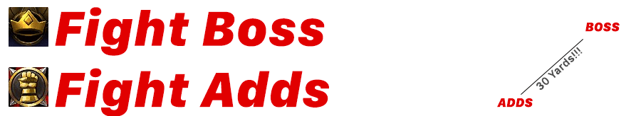

# Champions Of The Light

## The Boss
1. Keep adds ``30 yards`` from Boss
2. Seal of Retribution == BOSS
3. Seal of Reckoning   == ADDS

### Abilities
|Ability|Strategy|Description|
|---|---|---|
|Wave of Light|*AVOID*|`Heals adds.`
|Judgement Reckoning|*STACK*|`Raidwide damage, stack for healz.`

## The Adds
### Annointed Diciple

`INTERRUPT PRIORITY`
1. Heal
2. Pennance
3. Divine Burst (if interrupt-heavy)

### Crusaders
|Ability|Strategy|Description|
|---|---|---|
|Blinding Faith|*TURN AROUND*|`Don't face the add, big stun.`
|Crusader Strike|*TANK MITIGATE*|`Tank damaging ability.`
|Divine Burst|*Move Add Off Puddle*|`Tank moves the add out of the puddles.`
